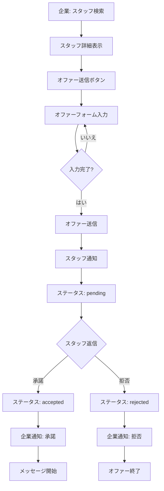
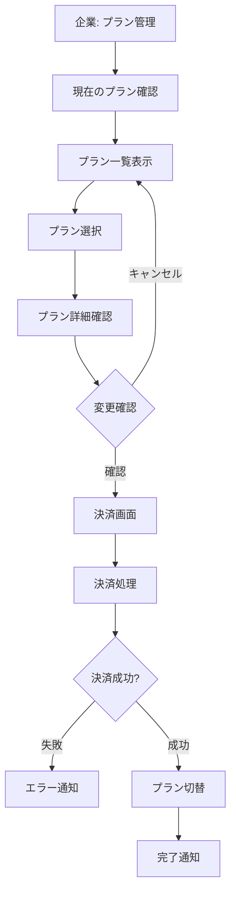

🎯 ヘッドハンティング管理アプリ 仕様書
バージョン: 1.1.0
作成日: 2026年3月13日
最終更新: 2026年3月13日

🎯 目次
1. [概要](#概要)
2. [システム構成](#システム構成)
3. [機能一覧](#機能一覧)
4. [画面仕様](#画面仕様)
5. [データモデル](#データモデル)
6. [ビジネスフロー](#ビジネスフロー)
7. [セキュリティ](#セキュリティ)
8. [変更履歴](#変更履歴)

🎯 概要

アプリケーション情報  
アプリ名: スタッフサーチ ヘッドハンティング管理  
パッケージ名: `com.stafffinder.headhunting_app`

プラットフォーム: Web  
ポート: 9090  
フレームワーク: Flutter 3.35.4  
Dart バージョン: 3.9.2

目的  
企業・店舗がスタッフにスカウトオファーを送信し、採用活動を行うための専用管理ツール。オファー管理、メッセージ機能、プラン管理などを提供する。

主要機能
- **スタッフ検索**: 条件別スタッフ検索・閲覧
- **オファー管理**: オファー作成・送信・ステータス管理
- **メッセージ機能**: スタッフとの直接メッセージ
- **プラン管理**: 有料プラン管理
- **お知らせ**: 運営からのお知らせ受信
- **通知**: オファー応答通知

🎯 システム構成

アプリアーキテクチャ

┌─────────────────────────────────────┐  
│ Headhunting App                     │  
│ Port: 9090                          │  
├─────────────────────────────────────┤  
│ 画面層 (Screens)                    │  
│ - ダッシュボード                   │  
│ - スタッフ検索                      │  
│ - オファー管理                      │  
│ - メッセージ                        │  
│ - プラン管理                        │  
│ - お知らせ                          │  
│ - 通知                              │  
└─────────────────────────────────────┘  
↓  
┌─────────────────────────────────────┐  
│ サービス層 (Services)              │  
│ - HeadhuntingAuthService           │  
│ - CompanyService                   │  
│ - NotificationService              │  
│ - AnnouncementService              │  
└─────────────────────────────────────┘  
↓  
┌─────────────────────────────────────┐  
│ データ層 (Storage)                 │  
│ - SharedPreferences                │  
│ - Firebase Firestore               │  
└─────────────────────────────────────┘

技術スタック

項目 | 技術 | バージョン
|------|------|-----------|
フレームワーク | Flutter | 3.35.4
言語 | Dart | 3.9.2
状態管理 | Provider | 6.1.5+1
ストレージ | shared_preferences | 2.5.3
HTTP通信 | http | 1.5.0
クラウドDB | Firebase Firestore | 5.4.3

⚙ 機能一覧

1. 認証・ログイン

1.1 企業ログイン
- [x] メールアドレス/パスワード認証
- [x] 自動ログイン機能
- [x] セッション管理

2. ダッシュボード

2.1 統計情報表示
- [x] 送信済みオファー数
- [x] 保留中オファー数
- [x] 承認済みオファー数
- [x] 拒否されたオファー数
- [x] メッセージ数
- [x] 未読メッセージ数
- [x] 新着通知数

2.2 最近のアクティビティ
- [x] 最新オファーステータス
- [x] 最新メッセージ
- [x] 最新通知

2.3 クイックアクション
- [x] スタッフ検索
- [x] オファー管理
- [x] メッセージ
- [x] プラン管理
- [x] お知らせ
- [x] 通知

3. スタッフ検索

3.1 検索機能
- [x] フリーワード検索
- [x] カテゴリ検索（8カテゴリ）
  - 美容・健康
  - 営業・接客
  - 専門職
  - クリエイティブ
  - IT・技術
  - 教育
  - 医療・介護
  - その他
- [x] エリア検索
- [x] フィルター機能
  - 性別
  - 年齢層
  - 評価
  - 経験年数
  - オンライン状態

3.2 検索結果表示
- [x] スタッフカード表示
  - プロフィール画像
  - 名前
  - 職種
  - カテゴリ
  - 評価
  - レビュー数
  - 所在地
  - 経験年数
  - オンライン状態
- [x] ページネーション
- [x] ソート機能

3.3 スタッフ詳細
- [x] プロフィール情報表示
- [x] 写真ギャラリー
- [x] スキル一覧
- [x] 自己紹介
- [x] レビュー一覧
- [x] オファー送信ボタン

4. オファー管理

4.1 オファー一覧
- [x] 全オファー表示
- [x] ステータス別タブ
  - 全て
  - 保留中（pending）
  - 承認済み（accepted）
  - 拒否（rejected）
- [x] 検索・フィルター
- [x] ソート機能

4.2 オファー作成
- [x] スタッフ選択
- [x] 職種入力
- [x] 仕事内容入力（マルチライン）
- [x] 給与入力
- [x] 福利厚生入力（マルチライン）
- [x] 送信ボタン
- [x] バリデーション

4.3 オファー詳細
- [x] オファー情報表示
  - スタッフ情報
  - 職種
  - 仕事内容
  - 給与
  - 福利厚生
  - ステータス
  - 送信日時
  - 返信日時
  - 返信メッセージ
- [x] オファー削除
- [x] スタッフへメッセージ送信

4.4 オファーステータス管理
- [x] pending: 保留中（スタッフ未返信）
- [x] accepted: 承認済み（スタッフが承諾）
- [x] rejected: 拒否（スタッフが辞退）
- [x] ステータス自動更新

5. メッセージ機能

5.1 メッセージ一覧
- [x] スタッフ別メッセージスレッド
- [x] 未読バッジ表示
- [x] 最終メッセージ表示
- [x] 検索機能

5.2 チャット機能
- [x] リアルタイムメッセージ送受信
- [x] メッセージ履歴表示
- [x] タイムスタンプ表示
- [x] 既読/未読管理
- [x] メッセージ削除

5.3 メッセージ作成
- [x] テキスト入力
- [x] 送信ボタン
- [x] 入力中表示

6. プラン管理

6.1 現在のプラン表示
- [x] プラン名
- [x] 月額料金
- [x] 有効期限
- [x] オファー送信可能数
- [x] 使用状況（残り送信可能数）

6.2 プラン一覧

- [x] **無料プラン**
  - 月額: 0円
  - オファー: 3件/月
  - メッセージ: 制限なし

- [x] **ベーシックプラン**
  - 月額: 9,800円
  - オファー: 20件/月
  - メッセージ: 制限なし
  - 優先表示

- [x] **プロプラン**
  - 月額: 29,800円
  - オファー: 100件/月
  - メッセージ: 制限なし
  - 優先表示
  - 専任サポート

- [x] **エンタープライズプラン**
  - 月額: 要相談
  - オファー: 無制限
  - メッセージ: 制限なし
  - 優先表示
  - 専任サポート
  - カスタマイズ可能

6.3 プラン変更
- [x] プラン選択
- [x] 変更確認
- [x] 決済処理
- [x] プラン切替完了

7. お知らせ

7.1 お知らせ一覧
- [x] 運営からのお知らせ表示
- [x] カテゴリ別表示
  - 重要
  - メンテナンス
  - 新機能
  - イベント
- [x] 公開日時表示
- [x] 未読バッジ

7.2 お知らせ詳細
- [x] タイトル
- [x] 本文
- [x] 画像表示
- [x] 公開日時
- [x] カテゴリ
- [x] 既読管理

8. 通知

8.1 通知一覧
- [x] 全通知表示
- [x] 未読/既読フィルター
- [x] 通知タイプ別表示
  - オファー応答
  - メッセージ受信
  - システム通知
- [x] タイムスタンプ表示

8.2 通知詳細
- [x] 通知内容
- [x] 関連リンク
- [x] 既読マーク

8.3 通知設定
- [x] プッシュ通知ON/OFF
- [x] メール通知ON/OFF
- [x] 通知タイプ別設定

🎯 画面仕様

ダッシュボード画面  
パス: `lib/screens/headhunting_dashboard_screen.dart`

機能:
- 統計情報カード表示（7枚）
- BottomNavigationBar（5タブ）
- クイックアクションボタン（6個）

統計カード:
1. 送信済みオファー数
2. 保留中オファー数
3. 承認済みオファー数
4. 拒否されたオファー数
5. メッセージ数
6. 未読メッセージ数
7. 新着通知数

クイックアクション:
- スタッフ検索
- オファー管理
- メッセージ
- プラン管理
- お知らせ
- 通知

UI要素:
- AppBar（タイトル）
- 統計カードグリッド（2列）
- クイックアクションボタンリスト
- BottomNavigationBar（5タブ）

スタッフ検索画面  
パス: `lib/screens/staff_search_screen.dart`

機能:
- 検索バー（フリーワード）
- カテゴリチップ（8個）
- フィルターボタン
- スタッフカードリスト
- ページネーション
- スタッフ詳細表示
- オファー送信ダイアログ

UI要素:
- 検索バー
- Wrap（カテゴリチップ）
- フィルターボタン
- GridView（スタッフカード、2列）
- ページネーションボタン
- FloatingActionButton（フィルター）

スタッフカード内容:
- プロフィール画像
- 名前
- 職種
- カテゴリバッジ
- 評価（星）
- レビュー数
- 所在地（アイコン）
- 経験年数
- オンライン状態（緑色バッジ）

オファー送信ダイアログ:
- 職種入力
- 仕事内容入力（マルチライン）
- 給与入力
- 福利厚生入力（マルチライン）
- キャンセル/送信ボタン

オファー管理画面  
パス: `lib/screens/offers_management_screen.dart`

機能:
- タブ切り替え（全て/保留中/承認済み/拒否）
- オファーカードリスト
- オファー詳細表示
- オファー削除
- スタッフへメッセージ

UI要素:
- TabBar（4タブ）
- TabBarView
- オファーカードリスト
- 詳細ダイアログ
- アクションボタン

オファーカード内容:
- スタッフ画像
- スタッフ名
- 職種
- 給与
- ステータスバッジ
  - 保留中: オレンジ
  - 承認済み: 緑
  - 拒否: 赤
- 送信日時
- タップで詳細表示

オファー詳細ダイアログ:
- スタッフ情報
- 職種
- 仕事内容（全文）
- 給与
- 福利厚生（全文）
- ステータス
- 送信日時
- 返信日時（承認/拒否時）
- 返信メッセージ（承認/拒否時）
- アクションボタン
  - オファー削除
  - スタッフへメッセージ

メッセージ画面  
パス: `lib/screens/staff_messages_screen.dart`

機能:
- メッセージスレッド一覧
- 未読バッジ表示
- チャット画面表示
- メッセージ送受信
- メッセージ削除

UI要素:
- スレッドリスト
- 未読バッジ
- チャット画面
- メッセージ入力フィールド
- 送信ボタン

スレッドリスト項目:
- スタッフ画像
- スタッフ名
- 最終メッセージ
- タイムスタンプ
- 未読バッジ（赤色、数字）

チャット画面:
- メッセージバブル
  - 送信: 右寄せ、青色
  - 受信: 左寄せ、灰色
- タイムスタンプ
- メッセージ入力フィールド（下部固定）
- 送信ボタン

プラン管理画面  
パス: `lib/screens/plan_management_screen.dart`

機能:
- 現在のプラン表示
- プラン一覧表示
- プラン変更
- 使用状況表示

UI要素:
- 現在のプランカード
- プランカードリスト（4枚）
- アップグレードボタン
- 使用状況プログレスバー

現在のプランカード:
- プラン名
- 月額料金
- 有効期限
- 使用状況
  - オファー送信: X / Y件
  - プログレスバー

プランカード:
- プラン名
- 月額料金
- オファー送信可能数
- メッセージ制限
- 優先表示（有/無）
- 専任サポート（有/無）
- アップグレードボタン

お知らせ画面  
パス: `lib/screens/announcements_screen.dart`

機能:
- お知らせ一覧表示
- カテゴリ別フィルター
- お知らせ詳細表示
- 既読管理

UI要素:
- カテゴリチップフィルター
- お知らせカードリスト
- 詳細ダイアログ

お知らせカード:
- タイトル
- カテゴリバッジ
- 公開日時
- 未読バッジ（青色ドット）
- 画像サムネイル（あれば）

お知らせ詳細ダイアログ:
- タイトル
- カテゴリ
- 公開日時
- 本文（全文）
- 画像（あれば）
- 閉じるボタン

通知画面  
パス: `lib/screens/notifications_screen.dart`

機能:
- 通知一覧表示
- 未読/既読フィルター
- 通知タイプ別フィルター
- 通知詳細表示
- 既読マーク

UI要素:
- フィルターボタン
- 通知カードリスト
- 詳細ダイアログ

通知カード:
- アイコン（タイプ別）
  - オファー応答: 📨
  - メッセージ: 📨
  - システム: 📨
- タイトル
- 本文（抜粋）
- タイムスタンプ
- 未読バッジ（青色背景）

通知詳細ダイアログ:
- タイトル
- 本文（全文）
- タイムスタンプ
- 関連リンク（あれば）
- 閉じるボタン

🎯 データモデル

`Company`（企業・店舗）

```dart
class Company {
  String id;              // 企業ID
  String name;            // 企業名
  String industry;        // 業種
  String description;     // 説明
  String address;         // 住所
  String phoneNumber;     // 電話番号
  String? website;        // ウェブサイト
  String? logoUrl;        // ロゴURL
  String contactEmail;    // 連絡先メール
  String contactPerson;   // 担当者名
  int employeeCount;      // 従業員数
  DateTime? establishedDate; // 開業日
  String benefits;        // 特典・福利厚生
  bool isVerified;        // 認証済み
  DateTime createdAt;     // 作成日時
  DateTime updatedAt;     // 更新日時
}
```

`HeadhuntingOffer`（オファー）

```dart
class HeadhuntingOffer {
  String id;              // オファーID
  String companyId;       // 企業ID
  String companyName;     // 企業名
  String staffId;         // スタッフID
  String staffName;       // スタッフ名
  String position;        // 職種
  String jobDescription;  // 仕事内容
  int salary;             // 給与
  String benefits;        // 福利厚生
  String status;          // ステータス (pending/accepted/rejected)
  String? responseMessage;// 返信メッセージ
  DateTime createdAt;     // 作成日時
  DateTime? respondedAt;  // 返信日時
}
```

`Message`（メッセージ）

```dart
class Message {
  String id;        // メッセージID
  String senderId;  // 送信者ID
  String receiverId;// 受信者ID
  String message;   // メッセージ本文
  DateTime sentAt;  // 送信日時
  bool isRead;      // 既読フラグ
}
```

`Plan`（プラン）

```dart
class Plan {
  String id;                 // プランID
  String name;               // プラン名
  int price;                 // 月額料金
  int offerLimit;            // オファー送信可能数
  bool hasMessageLimit;      // メッセージ制限有無
  bool hasPriorityDisplay;   // 優先表示有無
  bool hasDedicatedSupport;  // 専任サポート有無
  List<String> features;     // 機能一覧
}
```

`Announcement`（お知らせ）

```dart
class Announcement {
  String id;              // お知らせID
  String title;           // タイトル
  String content;         // 本文
  String category;        // カテゴリ (important/maintenance/feature/event)
  String targetAudience;  // 対象ユーザー (all/companies)
  DateTime publishedAt;   // 公開日時
  String? imageUrl;       // 画像URL
  bool isPublished;       // 公開状態
  int viewCount;          // 閲覧数
  DateTime createdAt;     // 作成日時
  DateTime updatedAt;     // 更新日時
}
```

`Notification`（通知）

```dart
class Notification {
  String id;        // 通知ID
  String userId;    // ユーザーID
  String type;      // タイプ (offer_response/message/system)
  String title;     // タイトル
  String body;      // 本文
  String? linkUrl;  // リンクURL
  bool isRead;      // 既読フラグ
  DateTime createdAt; // 作成日時
}
```

🎯 ビジネスフロー

オファー送信フロー



プラン変更フロー



🎯 セキュリティ

認証・認可

企業ログイン
- メールアドレス/パスワード認証
- セッション管理
- 自動ログアウト（30分）

権限管理
- 企業アカウント専用
- プラン別機能制限
- オファー送信制限

データ保護
- HTTPS通信
- データベース暗号化
- 個人情報保護

プライバシー
- スタッフ個人情報の適切管理
- オファー内容の機密性保持
- メッセージの暗号化

🎯 プラン比較表

機能 | 無料 | ベーシック | プロ | エンタープライズ
|------|------|------------|------|------------------|
月額料金 | 0円 | 9,800円 | 29,800円 | 要相談
オファー送信 | 3件/月 | 20件/月 | 100件/月 | 無制限
メッセージ | 制限なし | 制限なし | 制限なし | 制限なし
優先表示 | 📨 | 📨 | 📨 | 📨
専任サポート | 📨 | 📨 | 📨 | 📨
カスタマイズ | 📨 | 📨 | 📨 | 📨

🎯 変更履歴

v1.1.0 (2026-03-13)  
新機能:
- 📨 お知らせ機能
- 📨 通知機能
- 📨 プラン管理機能強化

改善:
- UI/UX改善
- パフォーマンス最適化

v1.0.0 (2026-03-01)  
初回リリース:
- 📨 スタッフ検索
- 📨 オファー管理
- 📨 メッセージ機能
- 📨 プラン管理

🎯 サポート・お問い合わせ

開発元: スタッフサーチ開発チーム  
企業向けサポート: `corporate@staffsearch.app`  
技術サポート: `tech@staffsearch.app`  
作成日: 2026年3月13日  
最終更新: 2026年3月13日  
バージョン: 1.1.0

