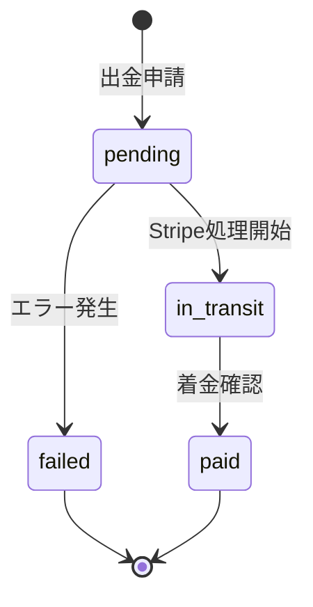

📱 スタッフサーチ メインアプリ 仕様書
バージョン: 1.3.0
作成日: 2026年3月13日
最終更新: 2026年3月13日

📱 目次
1. [概要](#概要)
2. [システム構成](#システム構成)
3. [機能一覧](#機能一覧)
4. [画面仕様](#画面仕様)
5. [データモデル](#データモデル)
6. [API仕様](#api仕様)
7. [セキュリティ](#セキュリティ)
8. [決済・出金システム](#決済出金システム)
9. [年齢制限・安全機能](#年齢制限安全機能)
10. [変更履歴](#変更履歴)

📱 概要

アプリケーション情報

アプリ名: スタッフサーチ (Staff Search)  
パッケージ名: `com.stafffinder.finder`  
プラットフォーム: Android / Web  
フレームワーク: Flutter 3.35.4  
Dart バージョン: 3.9.2

目的  
美容・接客業界のスタッフと顧客をマッチングするプラットフォーム。ユーザーはスタッフを検索・予約し、スタッフは自身のプロフィールを管理しサービスを提供する。

主要機能
- **スタッフ検索**: カテゴリ、エリア、条件で検索
- **予約システム**: メニュー選択、3希望日時選択、クーポン適用
- **チップ送信**: Stripe決済によるチップ送信機能
- **ライブ配信**: TikTok風ライブ配信・コラボ配信
- **ファンクラブ**: 月額制スタッフ応援システム
- **店舗・企業登録**: ヘッドハンティング・スカウト機能
- **出金管理**: Stripe Connect統合出金システム
- **安全機能**: 年齢制限、パトロール、ブロック管理

📱 システム構成

アプリアーキテクチャ

┌─────────────────────────────────────┐  
│ Flutter App (Main App)             │  
│ Port: 5060                         │  
├─────────────────────────────────────┤  
│ 画面層 (Screens)                   │  
│ - ホーム                           │  
│ - スタッフ検索                      │  
│ - 予約                             │  
│ - ライブ配信                       │  
│ - プロフィール                      │  
└─────────────────────────────────────┘  
↓  
┌─────────────────────────────────────┐  
│ サービス層 (Services)              │  
│ - LocalAuthService                 │  
│ - LocalBookingService              │  
│ - StripeConnectService             │  
│ - PatrolService                    │  
│ - AgeVerificationService           │  
└─────────────────────────────────────┘  
↓  
┌─────────────────────────────────────┐  
│ データ層 (Storage)                 │  
│ - SharedPreferences (Key-Value)    │  
│ - Hive (Document DB)               │  
│ - Firebase Firestore (Cloud DB)    │  
└─────────────────────────────────────┘

技術スタック

項目 | 技術 | バージョン
|------|------|-----------|
フレームワーク | Flutter | 3.35.4
言語 | Dart | 3.9.2
状態管理 | Provider | 6.1.5+1
ローカルDB | Hive + hive_flutter | 2.2.3 / 1.1.0
簡易ストレージ | shared_preferences | 2.5.3
HTTP通信 | http | 1.5.0
決済 | Stripe Connect | -
2Dゲーム | Flame | 1.32.0
広告 | google_mobile_ads | 5.3.1

⚙ 機能一覧

1. ユーザー機能

1.1 認証・プロフィール
- [x] ユーザー登録（メール/パスワード）
- [x] ログイン・ログアウト
- [x] プロフィール編集
- [x] 年齢確認（TikTok方式）
  - 13歳未満: 登録不可
  - 13-15歳: 閲覧・いいね・コメントのみ
  - 16-17歳: DM・ダウンロード可能
  - 18歳以上: ライブ配信可能（要確認）

1.2 スタッフ検索
- [x] カテゴリ検索（美容・健康、営業・接客、専門職等）
- [x] エリア検索（位置情報ベース）
- [x] 条件フィルター
  - 性別
  - 年齢層
  - 評価
  - 経験年数
  - オンライン状態
  - ライブ配信中
- [x] マップ検索（店舗・企業ピン表示）
- [x] お気に入り登録
- [x] フォロー機能

1.3 予約システム
- [x] メニュー選択（複数選択可）
- [x] 3希望日時選択
  - 第1希望（赤色）
  - 第2希望（オレンジ色）
  - 第3希望（青色）
- [x] クーポン適用
- [x] メモ入力
- [x] 価格計算（割引適用後）
- [x] 予約確定・キャンセル
- [x] 予約履歴表示

1.4 チップ送信
- [x] チップ金額選択
- [x] メッセージ付与
- [x] Stripe決済
- [x] 送信履歴表示

1.5 ライブ配信視聴
- [x] ライブ一覧表示
- [x] ライブ視聴
- [x] いいね送信
- [x] ギフト送信（スター、ハート、ダイヤモンド等）
- [x] コメント投稿
- [x] コラボ配信視聴
- [x] バトル配信視聴

1.6 ファンクラブ
- [x] ファンクラブ加入
- [x] 月額プラン選択（500円/1,000円/2,000円/5,000円）
- [x] 限定コンテンツ閲覧
- [x] 専用バッジ表示
- [x] 優先DM機能

1.7 安全機能
- [x] ユーザーブロック
- [x] ユーザーミュート
- [x] 通報機能（10種類の理由）
- [x] 禁止ワードフィルター
- [x] ストーカー行為検知
- [x] 利用規約・ガイドライン表示

2. スタッフ機能

2.1 スタッフ登録・プロフィール
- [x] スタッフ登録フォーム
  - 基本情報（名前、職種、カテゴリ）
  - プロフィール写真（複数枚）
  - 自己紹介
  - 所属店舗情報
  - 位置情報（緯度・経度）
  - QRコード生成
- [x] プロフィール編集
- [x] プレビュー表示
- [x] 出勤・退勤管理

2.2 予約管理
- [x] 予約一覧表示
- [x] 予約承認・拒否
- [x] メニュー管理
  - メニュー作成・編集・削除
  - 価格設定
  - 所要時間設定
- [x] クーポン管理
  - クーポン作成・編集・削除
  - 割引率・金額設定
  - 有効期限設定

2.3 チップ管理
- [x] チップ受取履歴
- [x] 残高表示（出金可能額/処理中）
- [x] 出金申請（Stripe Connect）
  - 最低出金額: 1,000円
  - 最大出金額: 1,000,000円/回
  - 処理期間: 3営業日
  - 手数料: 無料
- [x] 出金履歴表示
- [x] 銀行口座登録
- [x] 店舗還元率適用

2.4 ライブ配信
- [x] ソロライブ配信開始
- [x] コラボ配信開始（最大4人）
- [x] バトル配信（1対1/2対2）
- [x] ギフト受取
- [x] ライブリーグ参加
  - ブロンズ/シルバー/ゴールド/プラチナ/ダイヤモンド
- [x] かけらコレクション
- [x] ライブ特典（TikTok方式）
  - 18歳以上
  - 1,000人以上フォロワー
  - 過去30日で100時間以上配信

2.5 収益管理
- [x] 収益ダッシュボード
- [x] 日別・月別収益グラフ
- [x] チップ・予約・ギフト内訳
- [x] ファンクラブ収益
- [x] 店舗手数料計算

2.6 コミュニケーション
- [x] メッセージ機能
- [x] 通知機能
- [x] お知らせ表示

2.7 ブロック管理（NEW v1.3.0）
- [x] ブロック中ユーザー一覧
- [x] ミュート中ユーザー一覧
- [x] ブロック解除・ミュート解除
- [x] タブ切り替えUI

3. 店舗・企業機能

3.1 店舗登録
- [x] 店舗情報登録
  - 店舗名
  - 業種
  - 説明
  - 住所
  - 電話番号
  - ウェブサイト
  - メールアドレス
  - 担当者名
  - 従業員数
  - 開業日（DatePicker）
  - 特典・福利厚生
- [x] 店舗プロフィール編集
- [x] 複数店舗管理
  - 店舗一覧表示
  - 店舗追加・編集・削除
  - アクティブ店舗切替

3.2 スタッフ管理
- [x] 所属スタッフ一覧
- [x] スタッフ追加・削除
- [x] スタッフ検索・オファー送信
- [x] オファー管理
  - 送信済みオファー一覧
  - オファーステータス確認
- [x] スタッフ還元率設定（0-100%）

3.3 店舗特典
- [x] ライブ特典情報表示
- [x] スタッフ育成プログラム
- [x] 店舗ブランディング

📱 画面仕様

ホーム画面  
パス: `lib/screens/home_screen.dart`

機能:
- タブナビゲーション（ホーム/地図/ライブ/ランキング/プロフィール）
- おすすめスタッフ表示
- カテゴリ別検索
- 最近見たスタッフ
- ライブ配信中のスタッフ

UI要素:
- BottomNavigationBar（5タブ）
- 検索バー
- カテゴリチップ
- スタッフカード（グリッド表示）

スタッフ検索画面  
パス: `lib/screens/search_screen.dart`

機能:
- フリーワード検索
- フィルター適用
- 検索結果一覧
- ソート機能（人気順/評価順/新着順）

UI要素:
- 検索バー
- フィルターボタン
- ソートドロップダウン
- スタッフリスト

マップ検索画面（NEW v1.2.0）  
パス: `lib/screens/map_search_screen.dart`

機能:
- 地図上に店舗・企業ピン表示
- スタッフピン表示
- ピンタップで詳細表示
- 現在地表示

UI要素:
- Google Maps
- カスタムマーカー
- 情報ウィンドウ
- 現在地ボタン

スタッフ詳細画面  
パス: `lib/screens/staff_detail_screen.dart`

機能:
- プロフィール情報表示
- 写真ギャラリー（スワイプ）
- レビュー一覧
- 予約ボタン
- チップ送信ボタン
- フォローボタン
- ファンクラブ加入ボタン

UI要素:
- 画像カルーセル
- プロフィールカード
- レビューリスト
- アクションボタン群

予約画面（UPDATE v1.2.0）  
パス: `lib/screens/create_booking_screen.dart`

機能:
- メニュー選択（複数選択）
- 3希望日時選択
- カレンダー表示（今日〜90日後）
- 時間選択（09:00-20:00、30分刻み）
- 色分け表示（第1:赤、第2:オレンジ、第3:青）
- クーポン選択
- メモ入力
- 合計金額表示
- 予約確定

データフロー:
1. メニュー選択 → 合計金額計算
2. 日時選択（3回） → note に記録
3. クーポン選択 → 割引適用
4. 予約確定 → Booking作成  
   - bookingDate/Time: 第1希望  
   - note: 全3希望の情報

UI要素:
- メニューチェックボックスリスト
- カレンダーウィジェット
- 時間ドロップダウン
- クーポン選択ボタン
- テキストフィールド（メモ）
- 価格サマリー
- 予約確定ボタン

チップ送信画面  
パス: `lib/screens/tip_screen.dart`

機能:
- チップ金額選択（プリセット + カスタム）
- メッセージ入力
- Stripe決済
- 送信完了通知

UI要素:
- 金額選択ボタン
- メッセージ入力フィールド
- 送信ボタン

ライブ配信画面  
パス:
- `lib/screens/create_collab_screen.dart`（配信開始）
- `lib/screens/live_broadcaster_screen.dart`（配信中）

機能:
- ソロ/コラボ/バトル選択
- 配信開始
- いいね・ギフト受取
- コメント表示
- 視聴者数表示
- 配信終了

UI要素:
- ビデオプレビュー
- コメントオーバーレイ
- ギフトアニメーション
- 配信情報バー
- 終了ボタン

スタッフダッシュボード（UPDATE v1.3.0）  
パス: `lib/screens/staff/staff_dashboard_screen.dart`

機能:
- 出勤・退勤切替
- 統計情報（予約数/チップ/投稿数/評価）
- クイックアクション
  - 新規投稿
  - ライブ配信開始
  - メッセージ確認
  - コラボ配信開始
  - プレビュー確認
  - 予約確認
  - クーポン管理
  - 収益ダッシュボード
  - メニュー管理
  - 店舗からのオファー
  - ライブリーグ
  - かけらコレクション
  - **🚫 ブロック管理**（NEW v1.3.0）
  - **🚫 出金管理 (Stripe)**（NEW v1.3.0）
  - データ初期化（デバッグ）

UI要素:
- AppBar（出勤スイッチ）
- BottomNavigationBar（5タブ）
- 統計カード（4枚）
- アクションボタンリスト

ブロック管理画面（NEW v1.3.0）  
パス: `lib/screens/staff/staff_block_management_screen.dart`

機能:
- ブロック中ユーザー一覧
- ミュート中ユーザー一覧
- ブロック解除
- ミュート解除
- タブ切り替え

UI要素:
- AppBar（タイトル、タブバー）
- TabBarView（ブロック/ミュート）
- ユーザーカードリスト
- 解除ボタン

出金管理画面（NEW v1.3.0）  
パス: `lib/screens/staff/staff_payout_screen.dart`

機能:
- **出金申請タブ**:
  - 出金可能残高表示
  - 処理中残高表示
  - 出金額入力
  - クイック金額選択（5,000円/10,000円/50,000円/全額）
  - 出金申請ボタン
  - アカウントステータス確認
- **出金履歴タブ**:
  - 過去の出金記録一覧
  - ステータス表示（処理中/送金中/完了/失敗）
  - 着金予定日表示
- **ルールタブ**:
  - 最低出金額（1,000円）
  - 最大出金額（1,000,000円/回）
  - 出金手数料（無料）
  - 処理期間（3営業日）
  - 申請受付時間（平日15時まで）
  - 詳細説明

UI要素:
- TabController（3タブ）
- 残高カード
- 入力フィールド
- クイックボタン
- 出金申請ボタン
- 履歴リスト
- ルールカード

店舗管理画面（UPDATE v1.2.0）  
パス: `lib/screens/company/company_staff_management_screen.dart`

機能:
- **所属スタッフタブ**:
  - スタッフ一覧
  - スタッフ追加
  - スタッフ削除
- **オファー管理タブ**:
  - 送信済みオファー一覧
  - ステータス確認
- **還元率設定タブ**:
  - スライダー（0-100%）
  - 保存ボタン
- **ライブ特典タブ**:
  - 特典情報表示

UI要素:
- TabBar（4タブ）
- TabBarView
- スタッフカードリスト
- FAB（スタッフ追加）
- スライダー
- 保存ボタン

店舗一覧画面（NEW v1.2.0）  
パス: `lib/screens/store_management/store_list_screen.dart`

機能:
- 登録店舗一覧表示
- 店舗選択（アクティブ切替）
- 店舗追加
- 店舗編集
- 店舗管理（スタッフ）
- 店舗削除
- Pull-to-refresh

UI要素:
- AppBar（タイトル、追加ボタン）
- RefreshIndicator
- 店舗カードリスト
- 選択バッジ（緑色）
- アクションボタン

店舗編集画面（NEW v1.2.0）  
パス: `lib/screens/store_management/store_edit_screen.dart`

機能:
- 店舗情報編集
  - 店舗名
  - 業種（ドロップダウン）
  - 説明
  - 住所
  - 電話番号
  - ウェブサイト
  - メールアドレス
  - 担当者名
  - 従業員数
  - 開業日（日本語DatePicker）
  - 特典・福利厚生
  - スタッフ還元率（スライダー0-100%）
- 保存・キャンセル

UI要素:
- AppBar（タイトル、保存/キャンセルボタン）
- TextFormField（各項目）
- DropdownButtonFormField（業種）
- DatePicker（開業日）
- Slider（還元率）
- 保存ボタン

利用規約・ガイドライン画面（NEW v1.3.0）  
パス: `lib/screens/terms/terms_and_guidelines_screen.dart`

機能:
- **コミュニティガイドラインタブ**:
  - 基本ルール
  - 禁止行為
  - ペナルティ
- **ライブ配信ガイドラインタブ**:
  - 配信ルール
  - 禁止コンテンツ
  - 収益化ルール
- **著作権ポリシータブ**:
  - 著作権基本
  - 使用可能コンテンツ
  - 違反時の対応

UI要素:
- TabBar（3タブ）
- TabBarView
- スクロール可能コンテンツ
- セクション見出し
- テキストコンテンツ

プロフィール画面（UPDATE v1.3.0）  
パス: `lib/screens/profile_screen.dart`

機能:
- ユーザー情報表示
- 統計情報（フォロー/フォロワー/ポイント）
- メニュー項目
  - プロフィール設定
  - ブロック管理
  - ヘルプ・サポート
  - **利用規約・ガイドライン**（NEW v1.3.0）
  - アプリについて
  - ログアウト

UI要素:
- プロフィールヘッダー
- 統計カード
- メニューリスト
- ログアウトボタン

📱 データモデル

`User`（ユーザー）

```dart
class User {
  String id;              // ユーザーID
  String email;           // メールアドレス
  String name;            // 表示名
  String role;            // ロール (user/staff/admin)
  String? profileImage;   // プロフィール画像URL
  DateTime? birthDate;    // 生年月日（年齢確認用）
  DateTime createdAt;     // 作成日時
  DateTime updatedAt;     // 更新日時
}
```

`Staff`（スタッフ）

```dart
class Staff {
  String id;                 // スタッフID
  String name;               // 名前
  String jobTitle;           // 職種
  String category;           // カテゴリ
  String profileImage;       // プロフィール画像URL
  List<String> profileImages;// プロフィール画像リスト
  double rating;             // 評価
  int reviewCount;           // レビュー数
  String location;           // 所在地
  int experience;            // 経験年数
  String bio;                // 自己紹介
  List<String> skills;       // スキル
  double? latitude;          // 緯度（NEW v1.2.0）
  double? longitude;         // 経度（NEW v1.2.0）
  bool isOnline;             // オンライン状態
  bool isLive;               // ライブ配信中
  String qrCode;             // QRコード
  String? storeName;         // 店舗名
  String? companyName;       // 企業名
  int followersCount;        // フォロワー数
  double giftAmount;         // ギフト総額
  int categoryRank;          // カテゴリランク
  int totalStaffInCategory;  // カテゴリ内総スタッフ数
}
```

`Booking`（予約）

```dart
class Booking {
  String id;                 // 予約ID
  String userId;             // ユーザーID
  String userName;           // ユーザー名
  String staffId;            // スタッフID
  String staffName;          // スタッフ名
  String staffImage;         // スタッフ画像
  List<Map<String, dynamic>> menus; // 選択メニュー
  DateTime bookingDate;      // 予約日（第1希望）
  String bookingTime;        // 予約時間（第1希望）
  String status;             // ステータス (pending/confirmed/cancelled)
  int totalPrice;            // 合計金額
  int discountAmount;        // 割引額
  int finalPrice;            // 最終支払額
  String? couponCode;        // クーポンコード
  String? note;              // メモ（3希望日時情報含む）
  DateTime createdAt;        // 作成日時
  DateTime updatedAt;        // 更新日時
}
```

`Menu`（メニュー）

```dart
class Menu {
  String id;            // メニューID
  String staffId;       // スタッフID
  String name;          // メニュー名
  int price;            // 価格
  int duration;         // 所要時間（分）
  String? description;  // 説明
  bool isActive;        // 有効/無効
}
```

`Coupon`（クーポン）

```dart
class Coupon {
  String id;            // クーポンID
  String staffId;       // スタッフID
  String code;          // クーポンコード
  String name;          // クーポン名
  int discountType;     // 割引タイプ (0:金額, 1:割合)
  int discountValue;    // 割引値
  DateTime? expiryDate; // 有効期限
  int usageLimit;       // 使用回数制限
  int usedCount;        // 使用済み回数
  bool isActive;        // 有効/無効
}
```

`Company`（店舗・企業）（UPDATE v1.2.0）

```dart
class Company {
  String id;               // 企業ID
  String name;             // 企業名
  String industry;         // 業種
  String description;      // 説明
  String address;          // 住所
  String phoneNumber;      // 電話番号
  String? website;         // ウェブサイト
  String? logoUrl;         // ロゴURL
  String contactEmail;     // 連絡先メール
  String contactPerson;    // 担当者名
  int employeeCount;       // 従業員数
  DateTime? establishedDate; // 開業日（NEW v1.2.0）
  String benefits;         // 特典・福利厚生
  bool isVerified;         // 認証済み
  DateTime createdAt;      // 作成日時
  DateTime updatedAt;      // 更新日時
  List<String> staffIds;   // 所属スタッフID
  double tipCommissionRate;// スタッフ還元率 (0.0-100.0)
  bool isStore;            // 店舗フラグ
  double? latitude;        // 緯度（NEW v1.2.0）
  double? longitude;       // 経度（NEW v1.2.0）
}
```

`HeadhuntingOffer`（オファー）

```dart
class HeadhuntingOffer {
  String id;              // オファーID
  String companyId;       // 企業ID
  String companyName;     // 企業名
  String staffId;         // スタッフID
  String staffName;       // スタッフ名
  String position;        // 職種
  String jobDescription;  // 仕事内容
  int salary;             // 給与
  String benefits;        // 福利厚生
  String status;          // ステータス (pending/accepted/rejected)
  String? responseMessage;// 返信メッセージ
  DateTime createdAt;     // 作成日時
  DateTime? respondedAt;  // 返信日時
}
```

`PayoutRecord`（出金記録）（NEW v1.3.0）

```dart
class PayoutRecord {
  String id;         // 出金ID
  String userId;     // ユーザーID（スタッフID）
  int amount;        // 出金額（円）
  String currency;   // 通貨 (jpy)
  String status;     // ステータス (pending/in_transit/paid/failed)
  DateTime arrivalDate; // 着金予定日
  DateTime createdAt;   // 申請日時
  String description;   // 説明
}
```

`BalanceInfo`（残高情報）（NEW v1.3.0）

```dart
class BalanceInfo {
  int available;   // 出金可能額（円）
  int pending;     // 処理中の金額（円）
  String currency; // 通貨 (jpy)
}
```

`ConnectAccountStatus`（Stripeアカウント状態）（NEW v1.3.0）

```dart
class ConnectAccountStatus {
  bool isConnected;       // アカウント接続済み
  String? accountId;      // StripeアカウントID
  bool isVerified;        // 本人確認完了
  bool canReceivePayouts; // 出金可能
  String? email;          // メールアドレス
  String? country;        // 国コード (JP)
  String? currency;       // 通貨 (jpy)
  String? message;        // ステータスメッセージ
}
```

📱 API仕様

認証API

`POST /api/auth/register`

リクエスト:

```json
{
  "email": "user@example.com",
  "password": "password123",
  "name": "山田太郎",
  "birthDate": "1990-01-01"
}
```

レスポンス:

```json
{
  "success": true,
  "user": {
    "id": "user_001",
    "email": "user@example.com",
    "name": "山田太郎",
    "role": "user"
  },
  "token": "jwt_token_here"
}
```

予約API

`POST /api/bookings`

リクエスト:

```json
{
  "userId": "user_001",
  "staffId": "staff_001",
  "menus": [
    {"id": "menu_001", "name": "カット", "price": 5000}
  ],
  "bookingDate": "2026-03-20T00:00:00Z",
  "bookingTime": "14:00",
  "note": "第1希望: 2026-03-20 14:00\n第2希望: 2026-03-21 15:00\n第3希望: 2026-03-22 16:00",
  "couponCode": "SPRING2026"
}
```

レスポンス:

```json
{
  "success": true,
  "booking": {
    "id": "booking_001",
    "status": "pending",
    "totalPrice": 5000,
    "finalPrice": 4500
  }
}
```

Stripe Connect API（NEW v1.3.0）

`POST /api/stripe/connect/account`

リクエスト:

```json
{
  "email": "staff@example.com",
  "country": "JP"
}
```

レスポンス:

```json
{
  "success": true,
  "account_id": "acct_xxxxxxxxxxxxx",
  "onboarding_url": "https://connect.stripe.com/setup/..."
}
```

`GET /api/stripe/balance?user_id={USER_ID}`

レスポンス:

```json
{
  "available": 45000,
  "pending": 12000,
  "currency": "jpy"
}
```

`POST /api/stripe/payouts`

リクエスト:

```json
{
  "user_id": "staff_001",
  "amount": 10000,
  "currency": "jpy"
}
```

レスポンス:

```json
{
  "success": true,
  "payout_id": "po_xxxxxxxxxxxxx",
  "arrival_date": "2026-03-16T00:00:00Z",
  "message": "出金申請を受け付けました"
}
```

`GET /api/stripe/payouts/history?user_id={USER_ID}`

レスポンス:

```json
{
  "payouts": [
    {
      "id": "po_xxxxxxxxxxxxx",
      "amount": 10000,
      "status": "paid",
      "arrival_date": "2026-03-13T00:00:00Z",
      "created_at": "2026-03-10T10:30:00Z"
    }
  ]
}
```

📱 セキュリティ

認証・認可

JWT認証
- アクセストークン有効期限: 1時間
- リフレッシュトークン有効期限: 30日
- トークン保存: SharedPreferences（暗号化推奨）

ロール管理
- `user`: 一般ユーザー
- `staff`: スタッフ
- `admin`: 管理者

年齢確認システム（NEW v1.3.0）

年齢区分

年齢 | 制限内容
|------|---------|
13歳未満 | アカウント登録不可
13-15歳 | 閲覧・いいね・コメントのみ
16-17歳 | DM・動画ダウンロード可能
18歳以上 | ライブ配信可能（要年齢確認）

実装
- `AgeVerificationService`: 生年月日から年齢計算
- 機能制限チェック: `checkFeatureRestriction()`
- 年齢確認ステータス管理

パトロール機能（NEW v1.3.0）

禁止ワードフィルター
- 自動検知・マスキング
- リアルタイムフィルタリング
- カスタマイズ可能な禁止ワードリスト

ストーカー行為検知
- インタラクションスコアリング
  - 閲覧: 1ポイント
  - コメント: 3ポイント
  - DM: 5ポイント
  - フォロー: 2ポイント
- 警告レベル
  - 低: 0-15ポイント
  - 中: 16-30ポイント
  - 高: 31-50ポイント
  - ストーカー: 51ポイント以上

通報システム
- 通報理由（10種類）
  - スパム
  - ハラスメント
  - ヘイトスピーチ
  - 暴力的コンテンツ
  - ヌード・性的コンテンツ
  - 虚偽情報
  - 著作権侵害
  - プライバシー侵害
  - 未成年者の不適切利用
  - その他

ブロック機能（NEW v1.3.0）
- ユーザーブロック: 完全な接触遮断
- ユーザーミュート: 通知のみ無効化
- スタッフ側でのブロック管理

データ暗号化
- 通信: HTTPS/TLS 1.3
- パスワード: bcrypt（ソルト付きハッシュ）
- 個人情報: AES-256暗号化

セキュリティヘッダー
- `Content-Security-Policy: frame-ancestors *`
- `X-Frame-Options: ALLOWALL`
- `Access-Control-Allow-Origin: *`

📱 決済・出金システム（NEW v1.3.0）

Stripe Connect統合

金銭フロー

ユーザー → Stripe (3.6%手数料) → プラットフォーム (10%手数料)  
↓  
店舗 (還元率%) + スタッフ (残り%)  
↓  
銀行口座 (3営業日)

手数料配分

チップ1,000円の場合:

ステークホルダー | フリーランス | 所属(30%) | 所属(50%)
|------------------|-------------|----------|----------|
Stripe手数料 | 36円 | 36円 | 36円
プラットフォーム手数料 | 96円 | 96円 | 96円
店舗手数料 | 0円 | 260円 | 434円
**スタッフ受取額** | **868円** | **608円** | **434円**

出金ルール

項目 | 内容
|------|------|
最低出金額 | 1,000円
最大出金額 | 1,000,000円/回
出金手数料 | 無料
処理期間 | 3営業日
申請受付 | 平日15時まで

出金ステータス



決済セキュリティ
- PCI DSS準拠
- 3Dセキュア対応
- 不正検知システム
- 出金上限額設定
- 異常パターン検知

📱 パフォーマンス要件

レスポンスタイム
- 画面遷移: 200ms以内
- API レスポンス: 500ms以内
- 検索結果表示: 1秒以内

フレームレート
- UI操作: 60fps維持
- アニメーション: 60fps維持
- スクロール: 滑らかな体験

メモリ使用量
- アイドル時: 100MB以下
- 通常使用時: 200MB以下
- 最大使用量: 500MB以内

📱 対応プラットフォーム

Android
- 最小バージョン: Android 7.0 (API 24)
- 推奨バージョン: Android 10以降
- 画面サイズ: 4.5インチ〜7インチ

Web
- Chrome 90+
- Firefox 88+
- Safari 14+
- Edge 90+

📱 分析・トラッキング

イベントトラッキング
- 画面表示
- ボタンクリック
- 予約完了
- チップ送信
- 出金申請
- ブロック実行

ユーザー行動分析
- セッション時間
- 画面遷移フロー
- 離脱ポイント
- コンバージョン率

📱 変更履歴

v1.3.0 (2026-03-13)  
新機能:
- 🚫 スタッフブロック管理機能
- 🚫 Stripe Connect出金システム
- 🚫 利用規約・ガイドライン画面
- 🚫 年齢確認システム（TikTok方式）
- 🚫 パトロール機能（禁止ワード、ストーカー検知、通報）
- 🚫 金銭フロードキュメント

改善:
- スタッフダッシュボードにブロック管理・出金管理ボタン追加
- プロフィール画面に利用規約メニュー追加
- Stripe Connectサービス実装

v1.2.0 (2026-03-10)  
新機能:
- 🚫 店舗プロフィール編集機能
- 🚫 複数店舗管理機能
- 🚫 マップ検索（店舗・企業ピン表示）
- 🚫 予約3希望日時選択
- 🚫 店舗開業日入力（DatePicker）

改善:
- 店舗管理画面タブ統合（スタッフ/オファー/還元率/ライブ特典）
- Company モデルに緯度・経度フィールド追加
- 予約画面UI改善（カラー分け）

v1.1.0 (2026-03-05)  
新機能:
- 🚫 ライブ配信機能
- 🚫 ファンクラブシステム
- 🚫 店舗・企業登録
- 🚫 ヘッドハンティング・スカウト機能

v1.0.0 (2026-03-01)  
初回リリース:
- 🚫 ユーザー認証
- 🚫 スタッフ検索
- 🚫 予約システム
- 🚫 チップ送信
- 🚫 プロフィール管理

📱 サポート・お問い合わせ

開発元: スタッフサーチ開発チーム  
メール: `support@staffsearch.app`  
ウェブサイト: `https://staffsearch.app`  
作成日: 2026年3月13日  
最終更新: 2026年3月13日  
バージョン: 1.3.0

